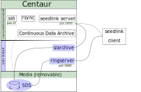

# Centaur tools

## Disclaimer

Do not try *any* of all those dumb ideas you have/will read on this page. You have been warned.

## Context
[Centaur digitizer](https://www.nanometrics.ca/index.php/products/instrumentation/centaur-digital-recorder) is a seismic acquisition system. It relies on a Linux operating system. It provides :

* real time data through [seedlink](http://www.seiscomp3.org/wiki/doc/applications/seedlink) protocol
* file data archive following a standard data structure ([SDS](https://www.seiscomp3.org/wiki/doc/applications/slarchive/SDS)) named *Continuous Data Archive* (with firmware >= 3.4.18).

##### Continuous Data Archive
But unfortunately in the Continuous Data Archive *an extra miniseed blockette* is added at 00h00m00s but not in the miniseed data coming from Centaur seedlink server. Moreover for a given data packet the sequence number in the Continuous Data Archive file *is not the same* from the one comming from seedlink. The blockette Id is reseted to 000001 at 00h00m00s in the Continuous Data Archive, whereas it is incremented for seedlink client. This leads the data completion process (rsync in delta/differential mode) to transfert *all* data archive rather than only the missing data packet ! 

##### Centaur seedlink server
Furthermore, different seedlink clients connected to the same Centaur seedlink server get same data packets (hopefully) **but** with different blockette Id. The first data packet received by client has a blockette Id set to 00001.

##### Data packet inspection
The [msi](https://github.com/iris-edu/msi) tool was used (using `msi -d`) to dump the data packets comming from *Centaur seedlink server* and from the *Continuous Data Archive*.

###### Data packet commming from Centaur seedlink server

<pre>
XX_GP003_00_HHZ, 019211, D, 512, 244 samples, 200 Hz, 2017,072,23:59:54.685000
   -1518       -1402       -1567       -1813       -1880       -1794
XX_GP003_00_HHZ, 019212, D, 512, 226 samples, 200 Hz, 2017,072,23:59:55.905000
   -1900       -1765       -1914       -2022       -1870       -1757
XX_GP003_00_HHZ, 019213, D, 512, 238 samples, 200 Hz, 2017,072,23:59:57.035000
   -1932       -1992       -2050       -2098       -2085       -1927
XX_GP003_00_HHZ, 019214, D, 512, 252 samples, 200 Hz, 2017,072,23:59:58.225000
   -1694       -1787       -1833       -1863       -1968       -1986
XX_GP003_00_HHZ, 019215, D, 512, 232 samples, 200 Hz, 2017,072,23:59:59.485000
   -1562       -1620       -1791       -1925       -1984       -1937
XX_GP003_00_HHZ, 019216, D, 512, 258 samples, 200 Hz, 2017,073,00:00:00.645000
   -2093       -1880       -1709       -1776       -1851       -1803
XX_GP003_00_HHZ, 019217, D, 512, 244 samples, 200 Hz, 2017,073,00:00:01.935000
   -1698       -1858       -1807       -1707       -1701       -1702
XX_GP003_00_HHZ, 019218, D, 512, 248 samples, 200 Hz, 2017,073,00:00:03.155000
   -2097       -2103       -2133       -2213       -2175       -2034
XX_GP003_00_HHZ, 019219, D, 512, 242 samples, 200 Hz, 2017,073,00:00:04.395000
   -2168       -2194       -2168       -1996       -1851       -1906
XX_GP003_00_HHZ, 019220, D, 512, 228 samples, 200 Hz, 2017,073,00:00:05.605000
   -1997       -2075       -1895       -1777       -1892       -1929
</pre>

###### Data packet commming from Continuous Data Archive (*ie.* SDS)
<pre>
XX_GP003_00_HHZ, 074381, D, 512, 244 samples, 200 Hz, 2017,072,23:59:54.685000
   -1518       -1402       -1567       -1813       -1880       -1794
XX_GP003_00_HHZ, 074382, D, 512, 226 samples, 200 Hz, 2017,072,23:59:55.905000
   -1900       -1765       -1914       -2022       -1870       -1757
XX_GP003_00_HHZ, 074383, D, 512, 238 samples, 200 Hz, 2017,072,23:59:57.035000
   -1932       -1992       -2050       -2098       -2085       -1927
XX_GP003_00_HHZ, 074384, D, 512, 252 samples, 200 Hz, 2017,072,23:59:58.225000
   -1694       -1787       -1833       -1863       -1968       -1986
XX_GP003_00_HHZ, 074385, D, 512, 103 samples, 200 Hz, 2017,072,23:59:59.485000
   -1562       -1620       -1791       -1925       -1984       -1937
XX_GP003_00_HHZ, 000001, D, 512, 129 samples, 200 Hz, 2017,073,00:00:00.000000
   -1979       -2183       -2250       -2192       -2092       -1950
XX_GP003_00_HHZ, 000002, D, 512, 258 samples, 200 Hz, 2017,073,00:00:00.645000
   -2093       -1880       -1709       -1776       -1851       -1803
XX_GP003_00_HHZ, 000003, D, 512, 244 samples, 200 Hz, 2017,073,00:00:01.935000
   -1698       -1858       -1807       -1707       -1701       -1702
XX_GP003_00_HHZ, 000004, D, 512, 248 samples, 200 Hz, 2017,073,00:00:03.155000
   -2097       -2103       -2133       -2213       -2175       -2034
XX_GP003_00_HHZ, 000005, D, 512, 242 samples, 200 Hz, 2017,073,00:00:04.395000
   -2168       -2194       -2168       -1996       -1851       -1906
</pre>

## Workflow
Do not forget to read the disclaimer section. The method presented here uses only standard seismological tools to fix this behaviour easily. It allows to :
 
* get real time data through seedlink protocol, 
* specify the seedlink server buffer size,
* recover gaps/missing data using standard  IT tools such as rsync in delta/differential mode.

The idea is to :

* replace *fully* the Centaur **Continuous Data Archive** process with `slarchive` -- or `slinktool` -- (link on [IRIS](https://ds.iris.edu/ds/nodes/dmc/software/downloads/slarchive/)),
* replace *partly* the Centaur **seedlink server** with `ringserser` (link on [github project](https://github.com/iris-edu/ringserver)).

`slarchive` is used localy, on the Centaur itself, to get real time data from the Centaur seedlink server (localhost:19000). It generates mseed data file in a SDS directory (on `/media/removable0`). This SDS directory is used by `ringserver` to populate its own seedlink server (running on port 18000) which uses the same seedlink sequence number for all clients, allowing smart gaps recovering.

## Installation
On the Centaur digitizer a set of tools has to be installed :

* `slarchive`
* `ringserver`
* `msi` (optional)
* bunch of scripts 

Those tools have been compiled for the Centaur digitizer using Qemu with the propoper Poky OS image (see below).
The scripts are used to automatize the ringserver and slarchive configuration and data flow pipeline. 

<pre>
centaur_tools
├── bin
│   ├── msi
│   ├── ringserver
│   └── slarchive
├── conf
│   └── ringserver.conf.template
├── log
│   ├── ringserver.log
│   ├── slarchive.log
│   └── tlog
├── scripts
│   ├── get_channels.sh
│   └── start_acqui.sh
└── var
    ├── ringserver
    │   ├── packetbuf
    │   └── scan.state
    └── slarchive
        └── slarchive.statefile
</pre>

### Where to install ?
As a prof of concept, just copy all the `centaur_tools` repositoy into `root@centaur:/media/removable0/`.

For permanent installation, it would be better to let the Centaur hosts all files (but SDS files !).
Several issues have to be solved though, see the [To be done section]() (feedbacks are welcome).

### Start centaur_tools acquisition
Look at `/media/removable0/centaur_tools/scripts/start_acqui.sh` to set up directories, then start it.

### Stop centaur_tools acquisition
See the [To be done section](), or kill the `slarchive` and `ringserser` processes.

### Data recovery with rsync
To recover missing data at the datacenter (mainly due to network outage) use rsync 
in delta/differential mode, using `-B` or `--block-size` option, on the SDS directory to get only the small differences. For extremly slow transmission link you can even limit the allocated bandwith setting `--bwlimit` option.

**Warning**: since Centaur CPU is not so powerfull, it is *not* recommended to run `rsync` on the whole SDS directory. I will take HUGE time to compute and check each block size on each file! It is better to select, on datacenter side, one file (`$f`) at a time with gaps (using `msi` for example) and use rsync such as :

<pre>
rsync --inplace --checksum  -a -v \
      --stats --timeout=$TIMEOUT \                            \
      -e "ssh -p $PORT" root@$centaur:/media/removable0/SDS/$f $TO/$f
</pre>

* `$PORT`: is the Centaur ssh port (default is 22)
* `$TIMEOUT`: If no data is transferred for the specified time then rsync will exit
* `$f`: gapped mseed file (*eg.* `2017/XX/GPIL/HHZ.D/XX.GPIL.00.HHZ.D.2017.291`)
* `$TO`: mseed SDS path on the datacenter

### To be done ... work in progress

* start and stop centaur_tools at system startup/shutdown :
	* default Centaur runlevel is 5
	* add script to `/etc/rc5.d`
	* resume previous state
* regulary check centaur_tools acquisition (script + crontab) :
	* health/status
	* cleanup space used by SDS directory,
* uses [Ansible](https://www.ansible.com/application-deployment) to automatize deployment, upgrade, status monitoring, 
* patch the *media eject script* to properly stop/restart slarchive and ringserver processes to allow them to 'write to'/'resume from' state files, and restart acquisition after media insertion. See :
	*  `/etc/init.d/usb-eject-button-daemon`, 
	*  `/usr/lib/nanometrics/startstop_utils`
*  centaur_tools installation : manage the double partition scheme.

## Centaur information

Some (raw) information about Centaur digitizer hardware.

### OS / Kernel

<pre>
Poky 8.0.2 (Yocto Project 1.3.2 Reference Distro) 1.3.2

Linux centaur-3-0491 3.11.10-custom #1 PREEMPT Tue Feb 14 14:22:36 EST 2017 armv5tejl GNU/Linux
</pre>

### Processor

<pre>
processor	: 0
model name	: ARM926EJ-S rev 5 (v5l)
BogoMIPS	: 184.72
Features	: swp half thumb fastmult edsp java
CPU implementer	: 0x41
CPU architecture: 5TEJ
CPU variant	: 0x0
CPU part	: 0x926
CPU revision	: 5

Hardware	: Nanometrics OMAPL-138 Helios V4 platform
Revision	: 0001
Serial		: 0000000000000000
</pre>

### Memory
<pre>
             total       used       free     shared    buffers     cached
Mem:        240320     234940       5380          0       3224      89640
-/+ buffers/cache:     142076      98244
Swap:            0          0          0
</pre>

## Qemu

You only need this if you want to compile yourself extra sofware for the Centaur.
Here is some ressources found on the internet related to Qemu and Yocto.

* Howto [Yocto and Qemu](http://www.crashcourse.ca/wiki/index.php/Yocto_and_QEMU) (link seems to be dead)
* [yoctoproject](http://downloads.yoctoproject.org/releases/yocto/yocto-1.3.2/machines/qemu/qemuarm/) for Qemu.

Choose this :

* Linux kernel : [zImage](http://downloads.yoctoproject.org/releases/yocto/yocto-1.3.2/machines/qemu/qemuarm/zImage-qemuarm.bin)
* [core-image](http://downloads.yoctoproject.org/releases/yocto/yocto-1.3.2/machines/qemu/qemuarm/core-image-lsb-dev-qemuarm-20130516201831.rootfs.tar.bz2), use lsb-dev to be able to compile softwares inside Qemu.

